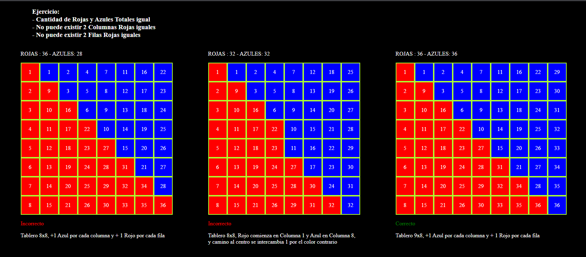

# Ejercio Tablero de Ajedrez

## Descripción del Ejercicio

```
Un niño está jugando a colorear su tablero de ajedrez y va a pintar cada casilla toda de azul o toda de rojo.

Para darle un toque personalizado, quiere pintar la misma cantidad de casillas rojas que de azules, pero no quiere que le queden dos columnas con la misma cantidad de casillas rojas pintadas, ni quiere que le queden dos filas con la misma cantidad de casillas rojas pintadas.


¿Puede lograr pintarlo cumpliendo esas condiciones?

¿Y si en vez de un tablero de ajedrez normal de 8x8 fuese un tablero de ajedrez gigante de 1000x1000?
```

## Respuesta

```
Para responder al problema planteado, se puede realizar un análisis de los requisitos necesarios para cumplir con las condiciones impuestas.

Primero, se debe tener en cuenta que un tablero de ajedrez tiene siempre una cantidad par de filas y columnas. Por lo tanto, si se desea pintar la misma cantidad de casillas rojas que de azules, se debe tener un número par de casillas de cada color.

Además, para evitar tener dos filas o dos columnas con la misma cantidad de casillas rojas pintadas, se debe tener una cantidad impar de filas o de columnas. De esta manera, se puede distribuir la misma cantidad de casillas rojas en cada fila o columna sin que ninguna tenga la misma cantidad que otra.

Sin embargo, si se tiene un tablero de ajedrez convencional con 8 filas y 8 columnas, no se cumplen las condiciones impuestas, ya que tanto las filas como las columnas tienen una cantidad par de casillas. Por lo tanto, no se puede lograr pintar el tablero de ajedrez de acuerdo a las condiciones establecidas.

En conclusión, si se tiene un tablero de ajedrez convencional con 8 filas y 8 columnas o un tablero especial de 1000 filas y 1000 columnas o tableros con la misma cantidad de filas y columnas, no se puede lograr pintarlo cumpliendo las condiciones de tener la misma cantidad de casillas rojas que de azules, y sin que haya dos filas o dos columnas con la misma cantidad de casillas rojas pintadas. Sin embargo, si se tuviera un tablero con una cantidad impar de filas o de columnas, se podría lograr cumplir con estas condiciones.
```

## Foto

